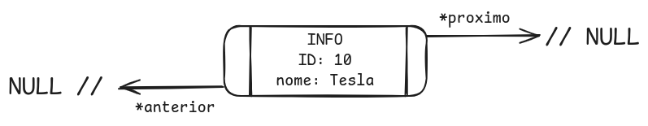
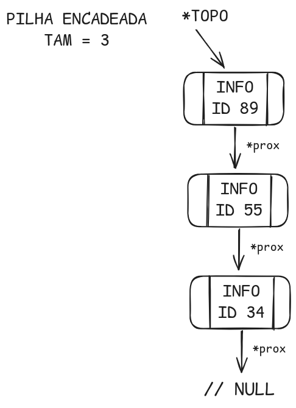
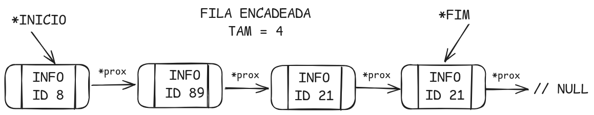
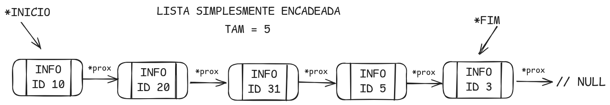
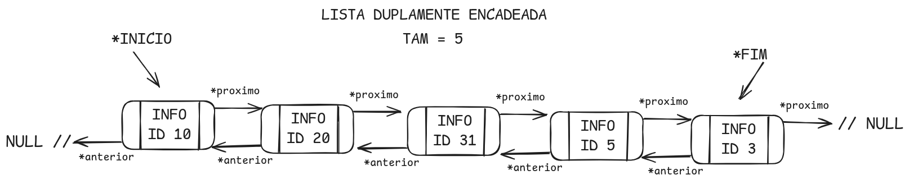

## TADs - Tipos Abstratos de Dados Encadeados em C

- [Informação Carregada Em Cada NO](#informação-carregada-em-cada-no)
- [Pilha Encadeada](#pilha-encadeada)
- [Fila Encadeada](#fila-encadeada)
- [Lista Simplesmente Encadeada](#lista-simplesmente-encadeada)
- [Lista Duplamente Encadeada](#lista-duplamente-encadeada)
- [Tabela HASH com Lista Simplesmente Encadeada](#tabela-hash-com-lista-simplesmente-encadeada)
- [Árvore Binária de Busca](#arvore-binária-de-busca)

<br>

__Necessário compilador GCC__

```sh
sudo apt update
sudo apt install build-essential
```

__Clone__

Execute todos comandos do GCC a partir da pasta raiz: ```tads```

```sh
git clone https://github.com/dalmofelipe/tads
cd tads
```

<br>

## Informação Carregada Em Cada NO

<p align="center">
    
</p>

A informação que cada NO das tads carregam é básica para exemplos, possui apenas um inteiro ID e string para um texto. O arquivo ```info.h``` contem a estrutura e metodos auxiliares.

```c
typedef struct info {
    int ID;
    char nome[MAXBUFF];
    // ...
}   INFO;


INFO INFO_default_value(); 
INFO INFO_set_value(int, char *);
INFO INFO_set_interativo(char *);
bool INFO_is_equal(INFO, INFO);
```

<br>

## Pilha Encadeada

É uma estrutura de dados que segue o princípio FILO (First In, Last Out). Isso significa que o último elemento adicionado à pilha será o primeiro a ser removido. A pilha é utilizada em diversas aplicações que requerem esse tipo de comportamento, como a avaliação de expressões matemáticas, gerenciamento de chamadas de função (stack frames), e mais.

<br>

### Compilar e Executar

```sh
gcc pilha.c -o pilha && ./pilha
```

### Estrutura

__Nós__ -  Cada elemento da pilha é armazenado em um nó que contém um valor (ou dados) e um ponteiro para o próximo nó na pilha.

__Topo__ -  A pilha mantém uma referência apenas ao nó no topo, que é o elemento mais recentemente adicionado. 

__Sem Nó Cabeça__ -  Diferentemente de algumas implementações que utilizam um nó cabeça como um marcador ou sentinela para simplificar operações, esta estrutura não utiliza esse nó extra. 

### Métodos e Procedimentos

```c
void PILHA_inicia(PILHA *);
bool PILHA_vazia(PILHA *);
void PILHA_empilhar(PILHA *, INFO);
INFO PILHA_get_topo(PILHA *);
INFO PILHA_desempilhar(PILHA *);
void PILHA_imprime(PILHA *);
void PILHA_drop(PILHA *);
```

<br>

## Fila Encadeada

<p align="center">
    
</p>

É uma estrutura de dados que segue o princípio FIFO (First In, First Out), ou seja, o primeiro elemento adicionado à fila será o primeiro a ser removido. A fila é análoga a uma fila de pessoas em um banco, onde as pessoas são atendidas na ordem em que chegam. São amplamente utilizadas em sistemas de processamento de dados, onde a ordem de chegada dos dados precisa ser mantida, como em filas de impressão, processamento de tarefas em sistemas operacionais, etc.

### Compilar e Executar

```sh
gcc fila.c -o fila && ./fila
```

### Estrutura

__Nós__ - Cada elemento da fila é armazenado em um nó que contém um valor (ou dados) e um ponteiro para o próximo nó na fila.

__Inicio e Fim__ - A fila mantém duas referências, uma para nó no inicio e outro para o fim da fila, onde o elemento mais recentemente adicionado pela fim da fila. 

__Sem Nó Cabeça__ - Esta implementação não utiliza esse nó extra. 

### Métodos e Procedimentos

```c
void FILA_inicia(FILA *);
bool FILA_vazia(FILA *, bool);
void FILA_enfileirar(FILA *, INFO);
INFO FILA_get_primeiro(FILA *);
INFO FILA_desemfilelar(FILA *);
void FILA_imprime(FILA *);
void FILA_drop(FILA *);
```

<br>

## Lista Simplesmente Encadeada

<p align="center">
    
</p>

Uma lista simplesmente encadeada é uma estrutura de dados fundamental em ciência da computação. Ela consiste em uma coleção de elementos, onde cada elemento (ou nó) contém um valor e uma referência (ou ponteiro) para o próximo nó na lista. É chamada de "simplesmente encadeada" porque cada nó tem apenas uma referência para o próximo nó.

```sh
gcc lista.c -o lista && ./lista
```

### Estrutura

__Nós__ - Elemento da lista que armazenado o valor e um ponteiro para o próximo nó da lista.

__Inicio ou Cabeça__ - Referência para nó do inicio lista.

__Fim ou Calda__ - Referências para nó do fim da fila. 

__Tamanho__ - Valor inteiro que é atualizado de acordo com a quantidade de Nos na lista. 

### Métodos e Procedimentos

```c
void LISTA_inicia(LISTA *);
bool LISTA_vazia(LISTA *, bool);
void LISTA_add_inicio(LISTA *, INFO);
void LISTA_add_fim(LISTA *, INFO);
void LISTA_add_posicao(LISTA *, INFO, int);
INFO LISTA_get_info(LISTA *, int);
int  LISTA_buscar_posicao_info(LISTA *, INFO);
INFO LISTA_remove_inicio(LISTA *);
INFO LISTA_remove_fim(LISTA *);
INFO LISTA_remover_busca(LISTA *, INFO);
INFO LISTA_remover_posicao(LISTA *, int);
void LISTA_prioridade_maxima(LISTA *, int);
void LISTA_prioridade_minima(LISTA *, int);
void LISTA_prioridade_deslocamento(LISTA *, int, int);
void LISTA_swap_info(LISTA *, int, int);
void LISTA_imprime(LISTA *);
void LISTA_drop(LISTA *);
```

<br>

## Lista Duplamente Encadeada

<p align="center">
    
</p>

Uma lista duplamente encadeada é uma estrutura de dados que consiste em uma sequência de elementos, chamados de nós, onde cada nó contém um valor e dois ponteiros: um que aponta para o nó anterior e outro que aponta para o nó seguinte. Isso permite a navegação tanto para frente quanto para trás na lista. Diferente de uma lista simplesmente encadeada (que possui apenas um ponteiro para o próximo nó), a lista duplamente encadeada facilita operações de inserção e remoção de nós em qualquer posição, já que não depende apenas de um único sentido de navegação.

### Vantagens:

- Permite fácil navegação bidirecional.

- Inserções e remoções em qualquer posição são mais fáceis comparadas a uma lista simplesmente encadeada.

- Útil para implementar estruturas como listas de navegação (onde é necessário voltar a um elemento anterior) e outras que exigem eficiência em operações de remoção e inserção.

### Desvantagens:

- Ocupa mais memória do que uma lista simplesmente encadeada devido ao armazenamento de dois ponteiros.

- Possui uma implementação mais complexa, principalmente em operações que exigem manipulação de ponteiros.

### Compilar e Executar

```sh
gcc lst_dupla.c -o lst_dupla && ./lst_dupla
```

### Estrutura

__Nós__ - Cada nó contém três partes principais: um valor ou dado, um ponteiro para o nó anterior e um ponteiro para o próximo nó.

__Inicio ou Cabeça__ - O primeiro elemento da lista, que geralmente possui o ponteiro anterior nulo.

__Fim ou Calda__ - O último elemento da lista, com o ponteiro para o próximo nó nulo.

__Inserção e remoção__ - A lista duplamente encadeada permite inserções e remoções eficientes tanto no início quanto no final da lista, ou em qualquer posição intermediária, já que possui ponteiros para ambos os lados.

__Tamanho__ - Valor inteiro que é atualizado de acordo com a quantidade de Nos na lista.

### Métodos e Procedimentos

```c
void LST_DUPLA_inicia(LISTA *);
bool LST_DUPLA_vazia(LISTA *, bool);
void LST_DUPLA_add_inicio(LISTA *, INFO);
void LST_DUPLA_add_fim(LISTA *, INFO);
void LST_DUPLA_add_posicao(LISTA *, INFO, int);
INFO LST_DUPLA_get_info(LISTA *, int);
int  LST_DUPLA_buscar_posicao_info(LISTA *, INFO);
INFO LST_DUPLA_remove_inicio(LISTA *);
INFO LST_DUPLA_remove_fim(LISTA *);
INFO LST_DUPLA_remover_busca(LISTA *, INFO);
INFO LST_DUPLA_remover_posicao(LISTA *, int);
void LST_DUPLA_prioridade_maxima(LISTA *, int);
void LST_DUPLA_prioridade_minima(LISTA *, int);
void LST_DUPLA_prioridade_deslocamento(LISTA *, int, int);
void LST_DUPLA_swap_info(LISTA *, int, int);
void LST_DUPLA_imprime(LISTA *);
void LST_DUPLA_drop(LISTA *);
```

<br>

## Tabela HASH com Lista Simplesmente Encadeada

WIP...


<br>

## Arvore Binária de Busca

WIP...
